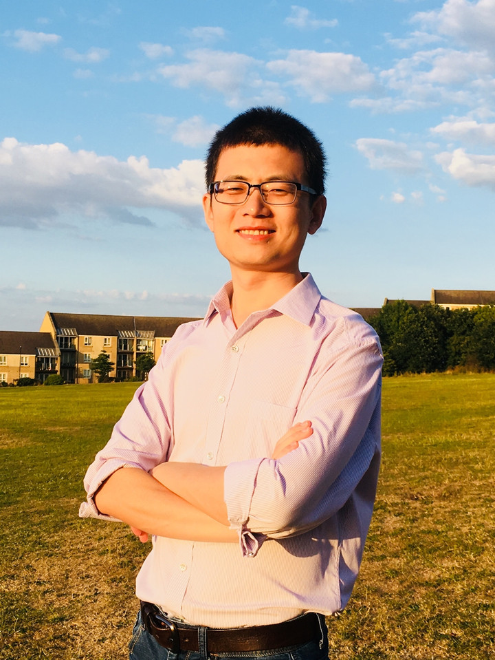

Principle Investigator
=======================

Academic Positions
  * Assistant Professor, Westlake University, Jan 2019 - present
  * Lecturer, University of Sheffield, Sep 2016 - Dec 2018
  * Postdoc, University of California, Riverside, Aug 2015 - Aug 2016
  * Postdoc, Technion - Israel Institute of Technology, Apr 2014 - Jul 2015
Education
  * PhD, National University of Singapore, Jan 2010 - Jan 2014
  * ME, Beijing University of Aeronautics and Astronautics, Sep 2006 - Mar 2009
  * BE, Beijing University of Aeronautics and Astronautics, Sep 2002 - Jun 2006
Awards
  * Best Paper Award (Guan Zhao-Zhi Award), the 33rd Chinese Control Conference, Nanjing, China, Jul 2014
  * Editorial Service
  * Associate Editor, IEEE/RSJ International Conference on Intelligent Robots and Systems (IROS), Macau, China, Nov 2019
  * Associate Editor, The 15th IFAC Symposium on Large Scale Complex Systems: Theory and Applications, Delft, The Netherlands, May 2019
  * Associate Editor, The 2019 International Conference on Unmanned Aircraft Systems (ICUAS), Atlanta, GA, USA, Jun 2019
  * Program Chair, The 15th IEEE International Conference on Control and Automation (ICCA), Edinburgh, UK, Jul 2019
  * Associate Editor, Unmanned Systems, 2018 - present
  * Guest Editor, Special Issue on "New Advances on Formation Control of Autonomous Vehicles" in Unmanned Systems, 2018
  * Associate Editor, The 15th International Conference on Control, Automation, Robotics and Vision (ICARCV), Singapore, Nov 2018
  * Associate Editor, IEEE/RSJ International Conference on Intelligent Robots and Systems (IROS), Marid, Spain, Oct 2018
  * Regional Chair, The 14th IEEE International Conference on Control and Automation (ICCA), Alaska, USA, Jun 2018
Review Service
  * IEEE Transactions on Automatic Control . Automatica . IEEE Transactions on Control Systems Technology . SIAM Journal on Control and Optimization . IEEE Transactions on Robotics . IEEE Transactions on Control of Network Systems . IEEE Transactions on Aerospace and Electronic Systems . International Journal of Robust and Nonlinear Control . Unmanned Systems . IEEE Transactions on Industrial Electronics . IEEE Transactions on Signal Processing . IET Control Theory & Applications . European Journal of Control . Control Engineering Practice . Signal Processing . Robotics and Autonomous Systems
